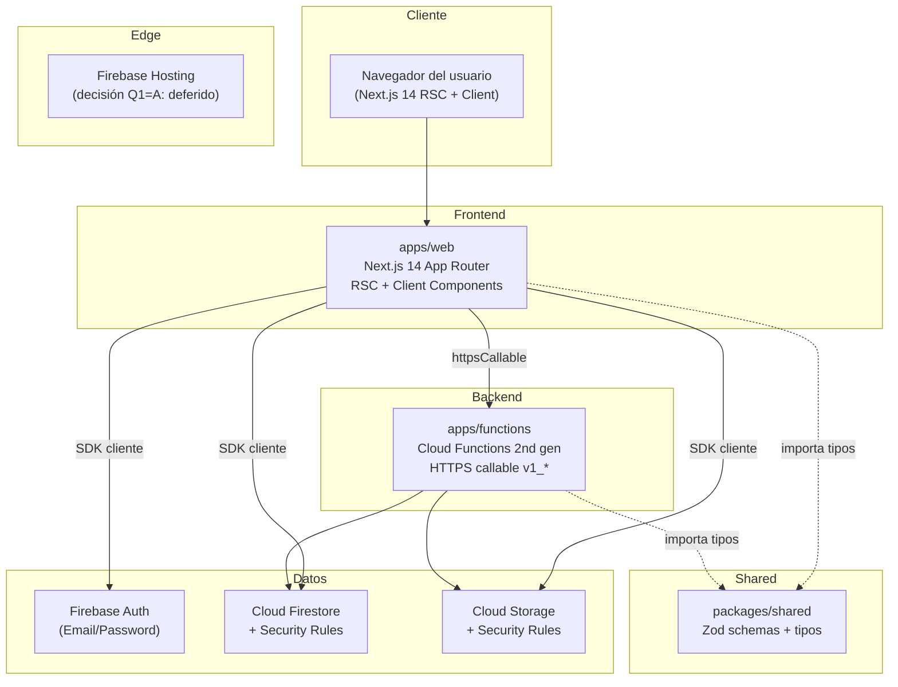
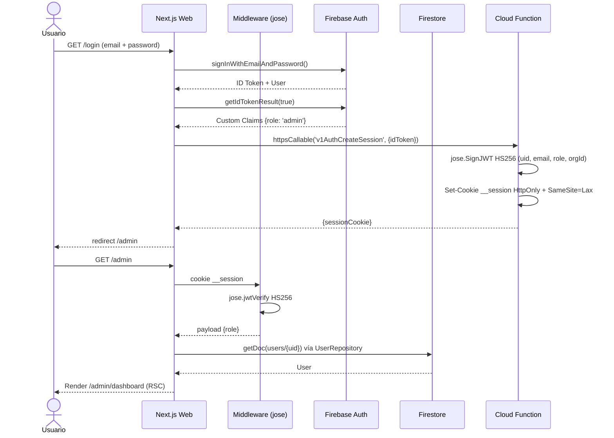
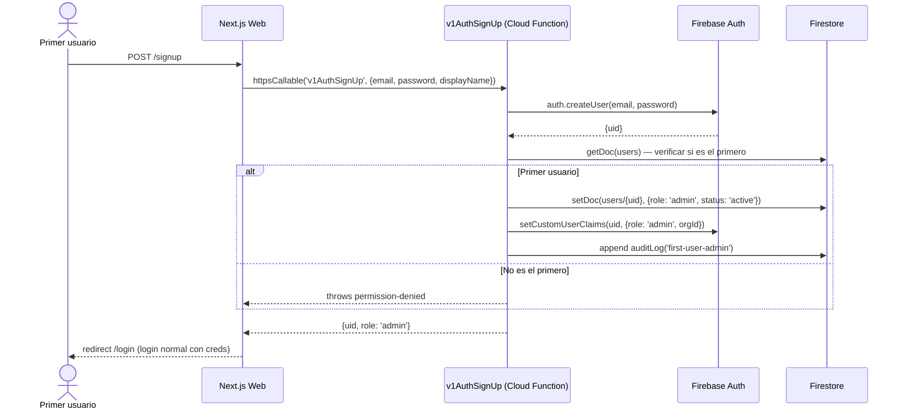
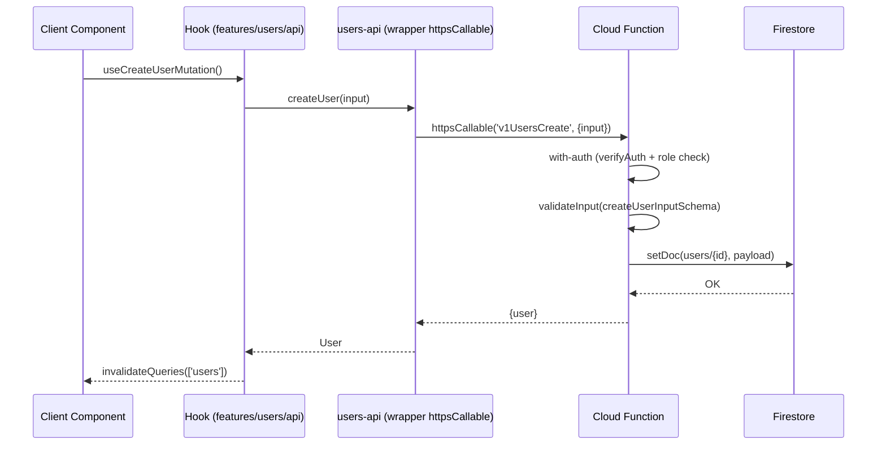
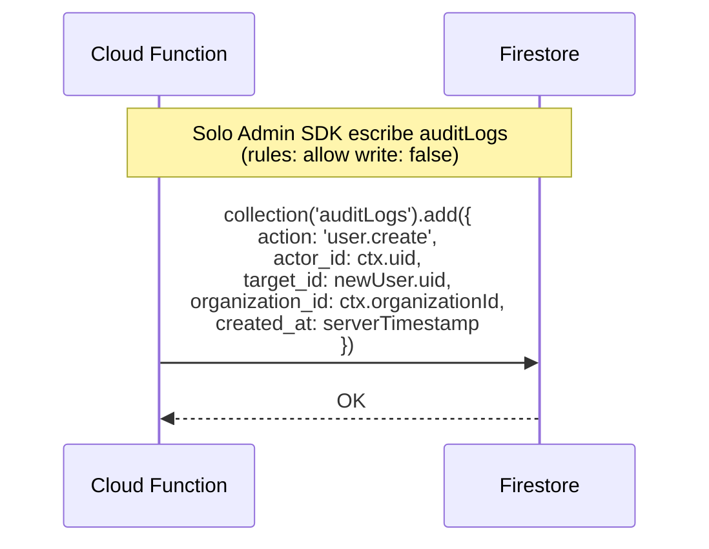

# Architecture

> **Versión**: 1.0
> **Estado**: Aprobado (junio 2026)
> **Origen**: este documento es la versión _root_ del proyecto. La versión
> detallada con ADRs y spec por componente vive en
> [`doc/sdd-package/01-architecture/ARCHITECTURE.md`](./doc/sdd-package/01-architecture/ARCHITECTURE.md).
> Este archivo es el **punto de entrada para un dev nuevo**.

---

## 1. ¿Qué es esto?

Plataforma de administración interna con IA. Monorepo pnpm con tres paquetes:

| Paquete           | Stack                              | Responsabilidad                                 |
| ----------------- | ---------------------------------- | ----------------------------------------------- |
| `apps/web`        | Next.js 14 (App Router) + React 18 | UI Server + Client Components, RSC, rutas admin |
| `apps/functions`  | Firebase Functions 2nd gen         | Endpoints tipados HTTPS callable (`v1_*`)       |
| `packages/shared` | TypeScript + Zod                   | Schemas, tipos inferidos, errores compartidos   |

Stack complementario: Firebase Auth + Firestore + Cloud Storage, TanStack
Query/Table, Zustand, shadcn/ui (Radix + Tailwind), `jose` (JWT HS256),
Vitest + Testing Library, ESLint flat config, Prettier, Husky + commitlint.

---

## 2. La regla de oro (capas)

```
┌──────────────────────────────────────────────────────────────────┐
│  /app  +  /components  +  /features        → React/Next.js      │
│  (UI, hooks, formularios)                  NO TOCA FIREBASE      │
├──────────────────────────────────────────────────────────────────┤
│  /services                                → Lógica de negocio   │
│  (orquestación, casos de uso)             NO TOCA FIREBASE      │
├──────────────────────────────────────────────────────────────────┤
│  /repositories  ←  INTERFAZ  +  IMPL FIREBASE  +  IMPL MEMORY   │
│  users/  organizations/  auditLogs/       ÚNICA QUE TOCA        │
│  FirebaseUserRepository  MemoryUserRepo   FIREBASE              │
├──────────────────────────────────────────────────────────────────┤
│  /lib/firebase  →  SDK wrappers (client.ts, admin.ts)            │
│                    ÚNICO lugar que importa `firebase/*`           │
└──────────────────────────────────────────────────────────────────┘
```

**Reglas**:

- Flecha hacia abajo: permitido.
- Flecha hacia arriba: **prohibida** (no se importa `@/repositories` desde
  una UI route que solo debería consumir `@/services`).
- `/repositories/<entidad>/index.ts` exporta **solo la interfaz y el tipo
  de error**. Las impls `firebase.ts` y `memory.ts` se inyectan vía
  factory según `env.REPOSITORY_DRIVER`.
- `/lib/firebase/*` es el **único** lugar donde se importan los SDKs de
  Firebase. ESLint lo enforce (`no-restricted-imports` en
  `eslint.config.mjs`).

---

## 3. Diagrama de sistema (alto nivel)



---

## 4. Estructura del monorepo

```
.
├── apps/
│   ├── web/                            # Next.js 14
│   │   ├── app/                        # Rutas (App Router)
│   │   │   ├── (auth)/                 # /login /signup
│   │   │   ├── admin/                  # /admin (RSC con verifyAuth)
│   │   │   │   ├── page.tsx            # Dashboard
│   │   │   │   ├── users/              # CRUD de usuarios
│   │   │   │   └── settings/           # Config global (admin only)
│   │   │   ├── error.tsx               # Error boundary root
│   │   │   └── not-found.tsx           # 404 custom
│   │   ├── components/                 # UI reutilizable
│   │   │   └── ui/                     # shadcn/ui (no editar a mano)
│   │   ├── features/                   # Módulos por dominio
│   │   │   ├── auth/                   # hooks + schemas + API
│   │   │   ├── users/                  # CRUD
│   │   │   └── settings/               # Configuración
│   │   ├── repositories/               # ÚNICA capa que toca Firebase
│   │   │   ├── users/  organizations/  audit-logs/
│   │   │   │   ├── types.ts            # Interfaz + Ctx
│   │   │   │   ├── firebase.ts         # impl Firestore
│   │   │   │   ├── memory.ts           # impl in-memory (tests)
│   │   │   │   ├── mapper.ts           # snake_case ↔ camelCase
│   │   │   │   ├── index.ts            # factory
│   │   │   │   └── __tests__/          # contract + memory + firebase
│   │   │   └── errors.ts               # RepositoryError (6 códigos)
│   │   ├── services/                   # Orquestación (no toca Firebase)
│   │   │   └── auth-service.ts         # verifyAuth/requireAuth/requireRole
│   │   ├── lib/                        # Utils + wrappers Firebase
│   │   │   └── firebase/
│   │   │       ├── client.ts           # Lazy SDK init + emulators
│   │   │       └── admin.ts            # Admin SDK (CF only)
│   │   ├── stores/                     # Zustand stores
│   │   ├── env.ts                      # Zod env validation
│   │   ├── middleware.ts               # JWT verification (jose HS256)
│   │   └── next.config.mjs             # Headers de seguridad
│   └── functions/                      # Cloud Functions 2nd gen
│       ├── src/
│       │   ├── v1/
│       │   │   ├── auth/               # signUp, createSession, clearSession
│       │   │   ├── users/              # create, list, update, delete
│       │   │   └── reports/            # generate-report
│       │   ├── shared/                 # with-auth, handle-error, validate-input
│       │   └── index.ts                # exports todos los handlers
│       └── package.json
├── packages/
│   └── shared/                         # Tipos + Zod schemas compartidos
│       └── src/
│           ├── schemas/                # users, organizations, audit-logs, common
│           └── errors/
├── doc/
│   └── sdd-package/                    # Spec original (9 SDDs)
│       ├── 01-architecture/            # ARCHITECTURE.md detallado
│       └── 02-sdds/                    # SDD-01 a SDD-09
├── aidlc-docs/                         # AI-DLC state + audit + reports
├── .github/
│   ├── workflows/                      # ci + deploy-staging + deploy-prod
│   ├── release-please-config.json
│   └── dependabot.yml
├── firebase.json                       # Emuladores + deploy targets
├── firestore.rules                     # Security rules
├── storage.rules                       # Security rules
├── commitlint.config.cjs               # Conventional Commits
└── package.json                        # Root (scripts + devDeps)
```

---

## 5. Flujos críticos

### 5.1 Login + acceso a `/admin`



### 5.2 First-user-admin (sistema bootstrap)



### 5.3 Llamada a Cloud Function desde el front



### 5.4 Auditoría (audit log)



---

## 6. Decisiones arquitectónicas (resumen)

| #   | Decisión                                                      | ADR                                                                                                          |
| --- | ------------------------------------------------------------- | ------------------------------------------------------------------------------------------------------------ |
| 1   | Monorepo pnpm con `apps/*` y `packages/*`                     | [`0001-monorepo-pnpm.md`](./doc/sdd-package/01-architecture/decisions/0001-monorepo-pnpm.md)                 |
| 2   | Repository pattern con interfaz + impl Firebase + impl Memory | [`0002-repository-pattern.md`](./doc/sdd-package/01-architecture/decisions/0002-repository-pattern.md)       |
| 3   | Firestore (no Realtime Database)                              | [`0003-firestore-over-rtdb.md`](./doc/sdd-package/01-architecture/decisions/0003-firestore-over-rtdb.md)     |
| 4   | Zod compartido cliente/servidor en `packages/shared`          | [`0004-zod-shared-validation.md`](./doc/sdd-package/01-architecture/decisions/0004-zod-shared-validation.md) |
| 5   | Lazy Firebase SDK init (Proxy + ensure\*)                     | [`0005-lazy-firebase-init.md`](./doc/sdd-package/01-architecture/decisions/0005-lazy-firebase-init.md)       |
| 6   | Custom Claims como única fuente de verdad para roles          | [`0006-custom-claims-roles.md`](./doc/sdd-package/01-architecture/decisions/0006-custom-claims-roles.md)     |
| 7   | `jose` HS256 para session cookie (no Firebase session cookie) | [`0007-jose-hs256-cookie.md`](./doc/sdd-package/01-architecture/decisions/0007-jose-hs256-cookie.md)         |
| 8   | First-user-admin hybrid bootstrap                             | [`0008-first-user-admin.md`](./doc/sdd-package/01-architecture/decisions/0008-first-user-admin.md)           |

> Si una decisión nueva entra en conflicto con alguna de las anteriores, gana
> la más nueva **solo si** está justificada en una ADR propia.

---

## 7. Configuración por entorno

| Entorno | Firebase project alias | Hosts permitidos                   | Cómo se deploya               |
| ------- | ---------------------- | ---------------------------------- | ----------------------------- |
| dev     | `<project>-dev`        | `localhost:3000`, `127.0.0.1:3000` | Emuladores (`pnpm emulators`) |
| staging | `<project>-staging`    | `staging.<dominio>`                | Auto en push a `main`         |
| prod    | `<project>-prod`       | `<dominio>`, `www.<dominio>`       | Manual con aprobación         |

Las variables se validan con Zod al arranque (`apps/web/env.ts` +
`apps/functions/src/env.ts`). Una variable requerida faltante o inválida
**falla el build**, no la primera request.

Detalle completo de variables y secrets: [`.env.example`](./.env.example) +
[`docs/CI-CD.md` §Secrets](./docs/CI-CD.md#secrets-requeridos).

---

## 8. Seguridad — checklist aplicado

- [x] Reglas de Firestore niegan por defecto (`match /{document=**} allow read,write: if false`).
- [x] Reglas de Storage niegan por defecto.
- [x] Custom Claims como única fuente de verdad para roles (`isSelf()` + `hasAnyRole()`).
- [x] JWT HS256 verificado en cada endpoint protegido (middleware + Cloud Function wrapper `with-auth`).
- [x] CORS explícito en Cloud Functions (whitelist por env en `ALLOWED_ORIGINS`).
- [x] Secrets fuera del código (`SESSION_COOKIE_SECRET` vía `defineSecret` + GitHub Secrets).
- [x] `__session` cookie `HttpOnly + SameSite=Lax + Secure` en prod.
- [x] Headers de seguridad en responses (`X-Content-Type-Options`, `X-Frame-Options`, `Referrer-Policy`).
- [x] ESLint rechaza `firebase/firestore|auth|storage` fuera de `repositories/*` + `lib/firebase/*`.
- [x] Audit log append-only con `allow write: if false` (solo Admin SDK escribe).

Detalles + política de reporte: [`SECURITY.md`](./SECURITY.md).

---

## 9. Performance — objetivos

- LCP < 2.5s en `/admin` y `/admin/users`.
- Bundle inicial landing < 200 KB gzip (actual: 171 kB First Load JS).
- TTFB < 600ms para rutas estáticas.
- Firebase cold start < 2s (mín. instances = 1 en staging/prod para endpoints críticos).

---

## 10. Cómo arrancar (TL;DR)

```bash
# 1. Prereqs
node --version   # >= 20
pnpm --version   # >= 9
java -version    # >= 11 (necesario para Firebase emulators)

# 2. Setup
pnpm install
cp .env.example .env.local      # editar NEXT_PUBLIC_FIREBASE_*

# 3. Levantar emuladores (auth + firestore + functions + storage)
pnpm emulators:detach           # background + log file

# 4. Sembrar datos (1 org + 3 users)
pnpm seed:emulators

# 5. Levantar web
pnpm --filter web dev           # http://localhost:3000

# 6. Verificación end-to-end
pnpm verify:auth                # 11/11 contra emuladores
pnpm typecheck && pnpm lint && pnpm test && pnpm build
```

Detalle paso a paso: [`README.md`](./README.md) §Setup local + [`CONTRIBUTING.md`](./CONTRIBUTING.md).

---

## 11. Documentos relacionados

- [`README.md`](./README.md) — onboarding 5 min.
- [`CONTRIBUTING.md`](./CONTRIBUTING.md) — branching, commits, PRs.
- [`DEPLOY.md`](./DEPLOY.md) — staging/prod + rollback + troubleshooting.
- [`SECURITY.md`](./SECURITY.md) — reporte de vulnerabilidades + hardenings.
- [`docs/CI-CD.md`](./docs/CI-CD.md) — workflows de GitHub Actions + secrets.
- [`doc/sdd-package/01-architecture/ARCHITECTURE.md`](./doc/sdd-package/01-architecture/ARCHITECTURE.md) — versión detallada con ADRs completas.
- [`doc/sdd-package/02-sdds/`](./doc/sdd-package/02-sdds/) — las 9 SDDs (SDD-01 a SDD-09).
- [`aidlc-docs/audit.md`](./aidlc-docs/audit.md) — log AI-DLC.
- [`aidlc-docs/aidlc-state.md`](./aidlc-docs/aidlc-state.md) — estado del proyecto.
