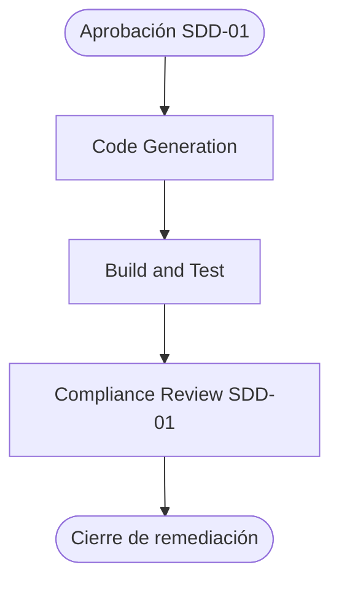

# Execution Plan — SDD-01 Remediation

## Scope

Cerrar los gaps activos del último compliance review de SDD-01 y verificar los gaps que ya fueron resueltos desde ese informe.

## Impact assessment

| Área        | Impacto | Descripción                                                                        |
| ----------- | ------- | ---------------------------------------------------------------------------------- |
| Tooling     | Alto    | Actualización de ESLint y `typescript-eslint` a versiones type-aware.              |
| Type safety | Medio   | Reactivar flags estrictos en `apps/web` y corregir incompatibilidades resultantes. |
| Testing     | Alto    | Thresholds mínimos de 70% y pruebas adicionales de lógica y contratos.             |
| Hooks Git   | Bajo    | Verificación de scripts existentes sin crear commits.                              |
| Producto    | Nulo    | No se modifican flujos de negocio ni UI funcional.                                 |

## Riesgos

- El upgrade de ESLint puede revelar errores type-aware existentes.
- Los flags estrictos pueden requerir ajustes de tipos en componentes generados.
- Elevar cobertura a 70% puede requerir pruebas en varios paquetes.
- Los emuladores Firebase están detenidos, por lo que la integración real se separará de la suite unitaria.

## Workflow AI-DLC



### Alternativa textual

```text
Aprobación → Code Generation → Build and Test → Compliance Review → Cierre
```

## Secuencia de cambios

1. Actualizar dependencias raíz y lockfile.
2. Configurar ESLint type-aware.
3. Reactivar strict TypeScript en `apps/web`.
4. Ajustar código o tests afectados por los tipos estrictos.
5. Configurar thresholds de cobertura al 70% y excluir únicamente artefactos no productivos.
6. Añadir pruebas de lógica y contratos necesarias para cumplir cobertura.
7. Verificar `vitest.setup.ts` y ausencia de ESLint legacy.
8. Verificar Husky y Commitlint sin crear commits.
9. Ejecutar validación completa.
10. Actualizar estado y auditoría AI-DLC con resultados verificables.

## Quality gates

- `pnpm lint`
- `pnpm typecheck`
- `pnpm test`
- `pnpm test:coverage`
- `pnpm build`
- `pnpm format:check`
- Validación de hooks y Commitlint

## Definition of Done

- Todos los gaps del informe SDD-01 están resueltos o verificados como ya resueltos.
- La suite y la build pasan con los thresholds configurados.
- El lockfile está sincronizado.
- El estado AI-DLC registra la remediación y sus evidencias.
- No se crea commit automáticamente.
