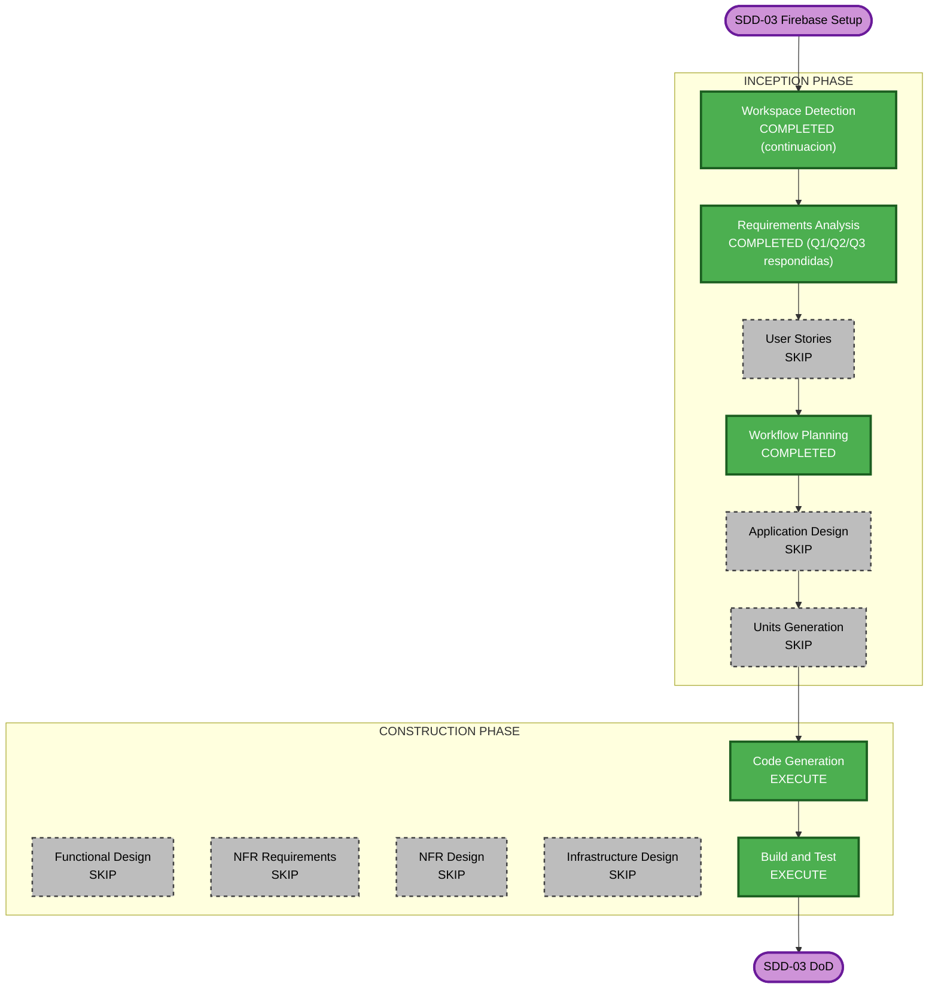

# Execution Plan — SDD-03 (Firebase Setup)

> Documento de plan de implementación. Generado al inicio de la etapa Code Generation del sprint SDD-03.

## Detailed Analysis Summary

### Transformation Scope

- **Transformation Type**: Infrastructure setup + SDK wrappers (new feature)
- **Primary Changes**: Firebase emulators config, security rules, SDK wrappers (client + admin), seed script
- **Related Components**: `apps/web` (Firebase client SDK), `apps/functions` (admin SDK + shell), `packages/shared` (Zod schemas)

### Change Impact Assessment

| Area        | Impacto | Descripción                                                      |
| ----------- | ------- | ---------------------------------------------------------------- |
| User-facing | No      | Sin UI nueva; solo wiring invisible                              |
| Structural  | Sí      | Nueva estructura `lib/firebase/`, `apps/functions/src/`, schemas |
| Data model  | Sí      | 3 schemas nuevos (users, organizations, audit-logs) + reglas     |
| API         | No      | (SDD-06)                                                         |
| NFR         | Sí      | Security baseline (reglas con denegación por defecto)            |

### Component Relationships

- **Primary**: `firebase.json`, `firestore.rules`, `storage.rules`, `apps/web/lib/firebase/client.ts`, `apps/functions/src/firebase-admin.ts`, `scripts/seed-emulators.ts`
- **Dependent**: `packages/shared` (schemas para setUserRole)
- **Unchanged**: `apps/web/app/**`, `packages/shared/src/index.ts` (solo extensión)

### Risk Assessment

- **Risk Level**: Medium
- **Rollback Complexity**: Easy (revert commits)
- **Testing Complexity**: Moderate (unit tests de client; rules testing requiere emuladores levantados = manual)

## Decisiones de usuario incorporadas

| Decisión                               | Valor                         | Fuente                                   |
| -------------------------------------- | ----------------------------- | ---------------------------------------- |
| Firebase App Check                     | A (Postergar a SDD-08)        | requirement-verification-questions.md Q1 |
| Strict `createdAt == request.time`     | A (Aplicar validación)        | requirement-verification-questions.md Q2 |
| Admin SDK sin credenciales en emulador | A (Detectar emulator env var) | requirement-verification-questions.md Q3 |

## Workflow Visualization



### Text Alternative

```
INCEPTION: WD/RA/WP done; User Stories/App Design/Units SKIP
CONSTRUCTION: Code Generation + Build and Test EXECUTE; design stages SKIP
```

## Phases to Execute

### INCEPTION PHASE

- [x] Workspace Detection — COMPLETED (continuación de sesión)
- [x] Requirements Analysis — COMPLETED (Q1=A, Q2=A, Q3=A)
- [x] User Stories — **SKIP**
  - **Rationale**: SDD-03 es infra/SDK wrappers sin features de usuario nuevas
- [x] Workflow Planning — COMPLETED (este documento)
- [ ] Application Design — **SKIP**
  - **Rationale**: Wrappers y config; sin arquitectura nueva
- [ ] Units Generation — **SKIP**
  - **Rationale**: Un solo bloque de trabajo cohesivo

### CONSTRUCTION PHASE

- [ ] Functional Design — **SKIP**
  - **Rationale**: Sin lógica de negocio nueva (auth helpers son SDD-05)
- [ ] NFR Requirements — **SKIP**
  - **Rationale**: Extensions de proyecto habilitadas; este sprint materializa Security Baseline
- [ ] NFR Design — **SKIP**
- [ ] Infrastructure Design — **SKIP**
- [ ] Code Generation — **EXECUTE**
- [ ] Build and Test — **EXECUTE**

## Code Generation Plan (detalle)

### Unit: `sdd-03-firebase-setup`

#### Bloque 1 — Configuración raíz (Emulators + Project)

- [ ] `firebase.json` con emuladores auth/firestore/functions/storage + UI puerto 4000
- [ ] `.firebaserc` con aliases dev/staging/prod
- [ ] `.gitignore` actualizado con `emulator-data/`

#### Bloque 2 — Reglas de seguridad

- [ ] `firestore.rules` con denegación por defecto + reglas para users/organizations/auditLogs
  - **Q2 aplicado**: `createdAt == request.time` en reglas de create
- [ ] `firestore.indexes.json` con 4 índices compuestos según `data-model.md`
- [ ] `storage.rules` con denegación por defecto + avatars/{uid} + reports/

#### Bloque 3 — Schemas compartidos

- [ ] `packages/shared/src/schemas/users.ts` (User, CreateUserInput, UpdateUserInput, Role)
- [ ] `packages/shared/src/schemas/organizations.ts` (Organization, CreateOrganizationInput)
- [ ] `packages/shared/src/schemas/audit-logs.ts` (AuditLog, AuditAction enum)
- [ ] `packages/shared/src/index.ts` actualizado con exports

#### Bloque 4 — Firebase Admin SDK (functions shell)

- [ ] `apps/functions/package.json` (dependencias firebase-admin, tsx dev)
- [ ] `apps/functions/tsconfig.json` (extends base, paths a @shared)
- [ ] `apps/functions/src/index.ts` (placeholder Cloud Functions)
- [ ] `apps/functions/src/firebase-admin.ts` con detección de emulador (Q3)
- [ ] `apps/functions/src/auth/set-custom-claims.ts` con `setUserRole(uid, role, orgId?)`

#### Bloque 5 — Firebase Client SDK (web wrapper)

- [ ] `apps/web/package.json`: agregar dep `firebase` (~10.x)
- [ ] `apps/web/lib/firebase/client.ts` con singletons + conexión automática a emuladores en dev
- [ ] `apps/web/lib/firebase/__tests__/client.test.ts` (mock `connect*Emulator`, verifica singletons)

#### Bloque 6 — Scripts de root

- [ ] `package.json` (root): scripts `emulators`, `emulators:reset`, `seed:emulators`, `emulators:test` + devDep `firebase-admin`
- [ ] `scripts/seed-emulators.ts` (1 org + 3 users idempotente)

#### Bloque 7 — Documentación

- [ ] `README.md`: paso de instalación de Firebase CLI, comandos de emuladores y seed

## Package Change Sequence

1. **packages/shared** — schemas (sin nuevas deps)
2. **apps/functions** — shell con firebase-admin
3. **apps/web** — dep `firebase` + wrapper client
4. **Root** — scripts + devDep `firebase-admin` para seed
5. **Verify** — `pnpm typecheck && pnpm lint && pnpm test && pnpm --filter web build`

## Estimated Timeline

- **Total Phases activas**: 2 (Code Generation, Build and Test)
- **Estimated Duration**: 1-2 horas de implementación

## Success Criteria (Acceptance Criteria de SDD-03)

- [ ] `pnpm emulators` levanta los 4 emuladores sin errores (requiere firebase-tools instalado)
- [ ] UI de emuladores accesible en `http://localhost:4000`
- [ ] `pnpm seed:emulators` puebla 1 org + 3 users idempotentemente
- [ ] Las reglas niegan acceso a un user no autenticado a cualquier doc
- [ ] Las reglas permiten al admin leer `users/*`
- [ ] Las reglas permiten al user editar solo `displayName`/`photoURL` de su propio doc
- [ ] Las reglas **niegan** escritura directa a `auditLogs` desde cliente
- [ ] `firestore.indexes.json` se valida con `firebase firestore:indexes --validate`
- [ ] `lib/firebase/client.ts` y `lib/firebase/admin.ts` exportan singletons
- [ ] En dev, `client.ts` se conecta automáticamente a los emuladores
- [ ] Test unitario de `client.ts` pasa
- [ ] ESLint rechaza `import { getAuth } from 'firebase/auth'` en `app/page.tsx` (ya configurado vía `no-restricted-imports`)

### Quality Gates (CI)

- `pnpm typecheck` exit 0
- `pnpm lint` exit 0 (max-warnings 0)
- `pnpm test` exit 0 (≥13 tests, +1 nuevo)
- `pnpm --filter web build` exit 0

## Limitations & Out of Scope

- **Validación runtime de reglas**: requiere emuladores levantados; no testeable sin `firebase emulators:exec`. Los criterios 4-7 se verifican manualmente desde UI de emuladores (per spec sección 6 "Plan de testing: Manual").
- **Cloud Functions reales**: SDD-06. En SDD-03 solo se crea el shell.
- **Hosting/CDN**: SDD-08.
- **App Check**: postergado a SDD-08 (Q1).

## Extensions (project-level, enabled)

| Extension              | Enabled | Applies to this sprint                               |
| ---------------------- | ------- | ---------------------------------------------------- |
| Security Baseline      | Yes     | **Sí** — denegación por defecto + reglas ortogonales |
| Resiliency Baseline    | Yes     | N/A este sprint                                      |
| Property-Based Testing | Yes     | Tests client.ts como pure init pattern               |
