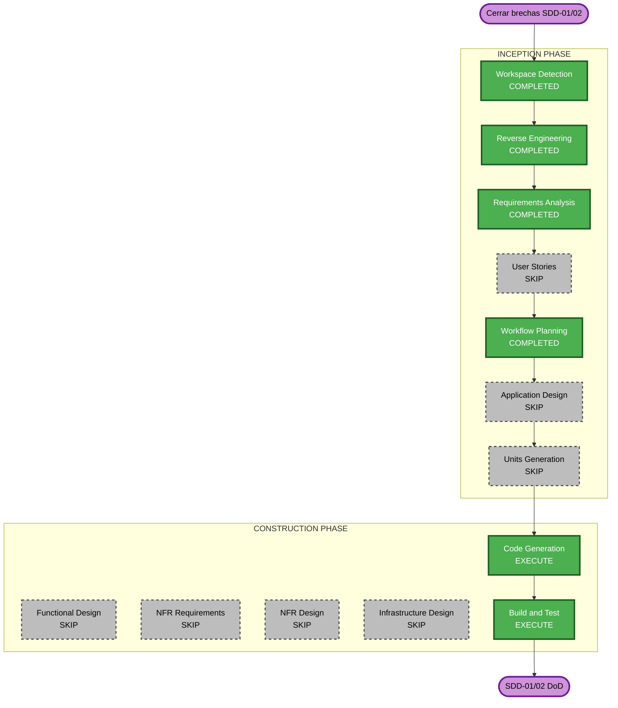

# Execution Plan — Cierre SDD-01 y SDD-02

## Detailed Analysis Summary

### Transformation Scope

- **Transformation Type**: Single-component / configuration gap closure
- **Primary Changes**: Toolchain (root ESLint) + frontend shell (`apps/web`)
- **Related Components**: `packages/shared` (sin cambios), `apps/functions` (sin cambios)

### Change Impact Assessment

| Area        | Impacto | Descripción                                                        |
| ----------- | ------- | ------------------------------------------------------------------ |
| User-facing | Mínimo  | Stub `/login` evita 404 en redirect del middleware                 |
| Structural  | No      | Sin nuevos módulos ni capas                                        |
| Data model  | No      | —                                                                  |
| API         | No      | —                                                                  |
| NFR         | Bajo    | ESLint + hooks restauran quality gate; security headers ya existen |

### Component Relationships

- **Primary**: root `package.json`, `eslint.config.mjs`, `apps/web`
- **Dependent**: Husky pre-commit (depende de lint OK)
- **Unchanged**: `packages/shared`, `apps/functions`

### Risk Assessment

- **Risk Level**: Low
- **Rollback Complexity**: Easy (revert commits)
- **Testing Complexity**: Simple (smoke: lint, typecheck, test, build)

## Decisiones de usuario incorporadas

| Decisión             | Valor                             |
| -------------------- | --------------------------------- |
| Scope Construction   | P0 + P1 + P2 (respuesta A)        |
| ESLint approach      | Fix mínimo ESLint 8 (respuesta B) |
| Security extension   | Enabled                           |
| Resiliency extension | Enabled                           |
| PBT extension        | Enabled                           |

## Workflow Visualization



### Text Alternative

```
INCEPTION: WD/RE/RA/WP done; User Stories/App Design/Units SKIP
CONSTRUCTION: Code Generation + Build and Test EXECUTE; design stages SKIP
```

## Phases to Execute

### INCEPTION PHASE

- [x] Workspace Detection — COMPLETED
- [x] Reverse Engineering — COMPLETED
- [x] Requirements Analysis — COMPLETED
- [x] User Stories — **SKIP**
  - **Rationale**: Cierre técnico de brechas SDD; sin nuevas features ni personas
- [x] Workflow Planning — COMPLETED
- [ ] Application Design — **SKIP**
  - **Rationale**: Sin componentes/servicios nuevos; cambios dentro de estructura existente
- [ ] Units Generation — **SKIP**
  - **Rationale**: Un solo bloque de trabajo (tooling + web); no descomposición multi-unidad

### CONSTRUCTION PHASE

- [ ] Functional Design — **SKIP**
  - **Rationale**: Sin lógica de negocio nueva
- [ ] NFR Requirements — **SKIP** (para este scope)
  - **Rationale**: Extensions habilitadas a nivel proyecto; este sprint es config/tooling
- [ ] NFR Design — **SKIP**
- [ ] Infrastructure Design — **SKIP**
- [ ] Code Generation — **EXECUTE**
  - **Rationale**: Implementar RF-SDD01-_ y RF-SDD02-_ P0-P2
- [ ] Build and Test — **EXECUTE**
  - **Rationale**: Verificar DoD con lint, typecheck, test, build

### OPERATIONS PHASE

- [ ] Operations — PLACEHOLDER

## Code Generation Plan (detalle)

### Unit: `sdd-gap-closure`

#### P0 — ESLint (RF-SDD01-01)

- [x] Instalar `typescript-eslint` compatible con ESLint 8
- [x] Verificar/fix `eslint.config.mjs` imports
- [x] Eliminar o alinear `apps/web/.eslintrc.json` duplicado (RF-SDD02-07)
- [x] `pnpm lint` exit 0

#### P1 — Web stubs y tests

- [x] Crear `apps/web/app/login/page.tsx` stub (RF-SDD02-01)
- [x] Crear `apps/web/lib/utils.test.ts` con tests de `cn()` (RF-SDD02-03, PBT)

#### P2 — Config y polish

- [x] Agregar `.editorconfig` (RF-SDD01-02)
- [x] Agregar `apps/.gitkeep` (RF-SDD01-03)
- [x] Agregar `apps/web/public/.gitkeep` (RF-SDD02-04)
- [x] `export const dynamic = 'force-dynamic'` en admin layout (RF-SDD02-02)

#### P3 — Opcional (fuera de scope acordado P0-P2)

- Wire `pnpm dev` root
- `packageManager` en package.json
- Revisar TS strict flags en web tsconfig

## Package Change Sequence

1. **Root** — ESLint deps + `.editorconfig` + `apps/.gitkeep`
2. **apps/web** — login stub, test, admin layout, public/, eslint cleanup
3. **Verify** — `pnpm lint && pnpm typecheck && pnpm test && pnpm --filter web build`

## Estimated Timeline

- **Total Phases activas**: 2 (Code Generation, Build and Test)
- **Estimated Duration**: 1-2 horas de implementación

## Success Criteria

- **Primary Goal**: SDD-01 y SDD-02 cumplen criterios de aceptación pendientes
- **Key Deliverables**:
  - `pnpm lint` funcional
  - Stub `/login` operativo
  - Test `cn()` verde
  - Archivos de config faltantes
- **Quality Gates**:
  - `pnpm typecheck` exit 0
  - `pnpm lint` exit 0
  - `pnpm test` exit 0 (≥1 test)
  - `pnpm --filter web build` exit 0
  - Pre-commit hooks ejecutables

## Extensions (project-level, enabled)

| Extension              | Enabled | Applies to this sprint                |
| ---------------------- | ------- | ------------------------------------- |
| Security Baseline      | Yes     | Parcial — headers ya OK; lint restore |
| Resiliency Baseline    | Yes     | N/A este sprint                       |
| Property-Based Testing | Yes     | Tests cn() como pure function         |
