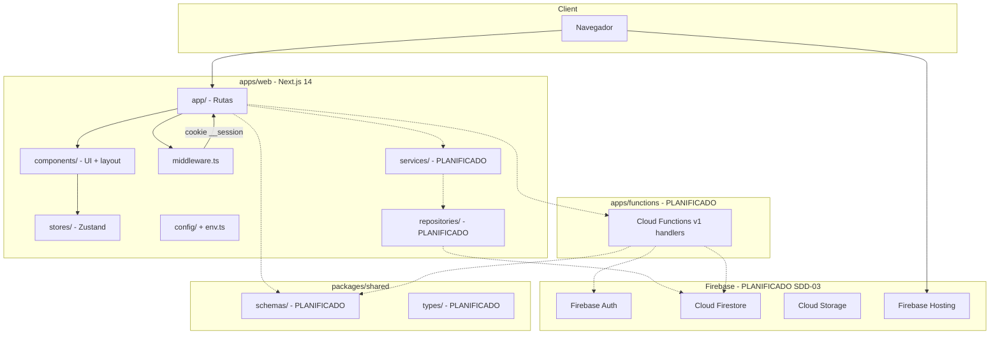
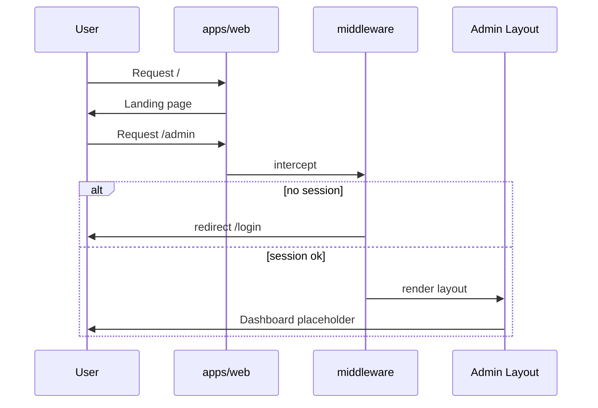

# System Architecture

## System Overview

Monorepo **pnpm** con arquitectura **vendor-agnostic** en capa de dominio. El panel admin (`apps/web`) usa Next.js 14 App Router. El backend serverless (`apps/functions`) esta planificado pero aun vacio. Los contratos compartidos viven en `packages/shared`.

**Estado de implementacion**: Fases SDD-01 y SDD-02 completadas parcialmente (toolchain + shell frontend). Firebase, repositorios, auth real y Cloud Functions pendientes (SDD-03 a SDD-08).

## Architecture Diagram

## Component Descriptions

### apps/web (@platform/web)

- **Purpose**: Aplicacion web administrativa
- **Responsibilities**: UI, routing, middleware de auth, providers (theme, query, toast), layout admin
- **Dependencies**: React 18, Next.js 14, Radix/shadcn, TanStack Query, Zustand, Zod (env)
- **Type**: Application

### apps/functions

- **Purpose**: Backend serverless (Cloud Functions 2nd gen)
- **Responsibilities**: Endpoints callable HTTPS, operaciones privilegiadas
- **Dependencies**: Firebase Admin SDK (planificado)
- **Type**: Application (placeholder vacio)

### packages/shared (@platform/shared)

- **Purpose**: Tipos y schemas compartidos
- **Responsibilities**: Zod schemas, tipos inferidos, errores compartidos
- **Dependencies**: Zod
- **Type**: Shared/Model

## Data Flow

## Integration Points

- **External APIs**: Cloud Functions callable HTTPS (planificado), webhooks ATS (planificado)
- **Databases**: Cloud Firestore — users, organizations, auditLogs (planificado SDD-04)
- **Third-party Services**: Firebase Auth (Email + Google planificado), Resend email (env var), Firebase Storage (planificado)

## Infrastructure Components

- **CDK Stacks**: No aplica — stack Firebase serverless, no CDK/Terraform en repo
- **Deployment Model**: Firebase Hosting + Cloud Functions (planificado SDD-08); scripts `deploy:staging`/`deploy:prod` son placeholders
- **Networking**: Cloud CDN via Firebase Hosting; CORS configurado via `ALLOWED_ORIGINS`
