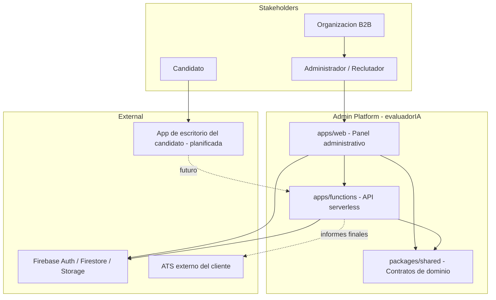

# Business Overview

## Business Context Diagram



### Text Alternative

```
Stakeholders: Admin/Reclutador, Candidato, Organizacion B2B
Platform: apps/web (panel admin), apps/functions (API), packages/shared (schemas)
External: Firebase, ATS, app de escritorio (planificada)
```

## Business Description

- **Business Description**: Plataforma administrativa B2B para gestionar evaluaciones técnicas de candidatos. El producto final (descrito en `doc/`) es una solución de reclutamiento técnico con proctoring, anti-trampas e IA de nivelación (Junior/Senior). El código actual implementa la **fase inicial** del panel admin (SDD-01/02): monorepo, shell de UI y protección básica de rutas.
- **Business Transactions**:
  - **BT-01 Gestionar sesion admin** — Login, sesion persistente, acceso a `/admin/**` (planificado SDD-05; parcial: middleware con cookie `__session`)
  - **BT-02 Administrar usuarios** — CRUD de usuarios con roles (`admin`, `recruiter`, `expert`) (planificado SDD-04/06/07)
  - **BT-03 Administrar organizaciones** — Multi-tenant por organizacion (planificado SDD-04)
  - **BT-04 Auditar acciones** — Registro de audit logs (planificado SDD-04)
  - **BT-05 Invitar y evaluar candidatos** — Invitaciones, plantillas, dashboard de estado (planificado en System Design; no implementado)
  - **BT-06 Generar informes** — Reportes con nivelacion IA y envio a ATS (planificado SDD-06; endpoint `generateReport`)
- **Business Dictionary**:
  - **Admin Platform**: Panel web para reclutadores y administradores
  - **Organization**: Tenant B2B con usuarios y configuracion propia
  - **Role**: `admin` | `recruiter` | `expert` — control de acceso por custom claims
  - **Repository Driver**: `memory` (dev/test) o `firebase` (staging/prod) — abstraccion vendor-agnostic
  - **SDD**: Software Design Document — especificacion por fase del master plan
  - **Evaluacion tecnica**: Proceso donde un candidato responde pruebas supervisadas con calificacion IA

## Component Level Business Descriptions

### apps/web (@platform/web)

- **Purpose**: Interfaz administrativa para reclutadores y administradores
- **Responsibilities**: Renderizar UI, proteger rutas `/admin`, orquestar llamadas a servicios/API, gestionar estado de UI (sidebar, tema)

### apps/functions (placeholder)

- **Purpose**: Backend serverless para operaciones privilegiadas (crear usuarios, generar reportes)
- **Responsibilities**: Endpoints HTTPS callable v1, validacion Zod, auth con custom claims, side effects en Firestore/Auth

### packages/shared (@platform/shared)

- **Purpose**: Contratos compartidos entre frontend y backend
- **Responsibilities**: Schemas Zod, tipos TypeScript, errores tipados (planificado; actualmente solo exporta version)

## Interaction Diagrams

Ver `interaction-diagrams.md` para flujos detallados de transacciones de negocio.
