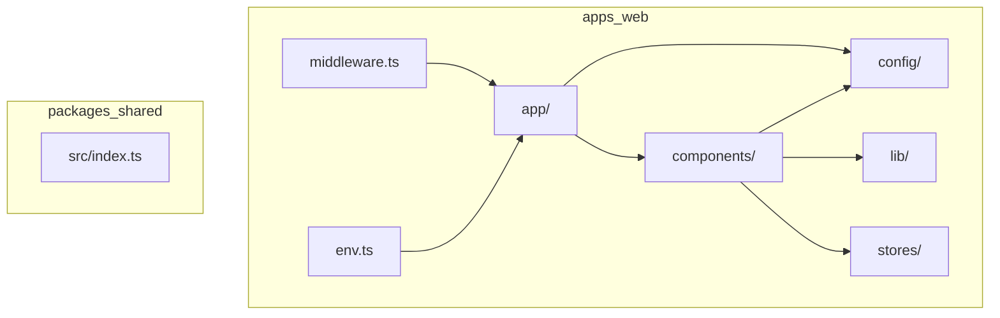

# Code Structure

## Build System

- **Type**: pnpm monorepo (npm-compatible)
- **Configuration**:
  - `pnpm-workspace.yaml` — workspaces: `apps/*`, `packages/*`
  - `package.json` (root) — scripts globales: build, lint, typecheck, test, format
  - `tsconfig.base.json` + `tsconfig.json` — TypeScript estricto compartido
  - `vitest.config.ts` (root) — test runner
  - `eslint.config.mjs`, `.prettierrc.json`, `commitlint.config.cjs`, Husky hooks

## Key Classes/Modules

### Existing Files Inventory

**apps/web/app/**

- `layout.tsx` — Root layout con ThemeProvider, QueryProvider, ToastProvider
- `page.tsx` — Landing page publica
- `admin/layout.tsx` — Shell admin: Sidebar + Header + main
- `admin/page.tsx` — Dashboard placeholder
- `error.tsx` — Error boundary
- `loading.tsx` — Loading UI
- `not-found.tsx` — 404 page

**apps/web/components/layout/**

- `sidebar.tsx` — Navegacion colapsable con NAV_ITEMS
- `header.tsx` — Barra superior con theme toggle y user menu
- `theme-toggle.tsx` — Toggle dark/light mode
- `user-menu.tsx` — Dropdown menu placeholder (sin auth real)

**apps/web/components/providers/**

- `theme-provider.tsx` — next-themes wrapper
- `query-provider.tsx` — TanStack Query client
- `toast-provider.tsx` — Sonner toasts

**apps/web/components/ui/**

- `avatar.tsx`, `button.tsx`, `card.tsx`, `dropdown-menu.tsx`, `input.tsx`, `label.tsx`, `separator.tsx`, `sheet.tsx`, `sonner.tsx`, `tabs.tsx` — Componentes shadcn/ui

**apps/web/config/**

- `constants.ts` — NAV_ITEMS, ROLES, tipo Role

**apps/web/lib/**

- `utils.ts` — `cn()` helper (clsx + tailwind-merge)
- `helpers.ts` — formatDate, formatNumber, slugify

**apps/web/stores/**

- `ui-store.ts` — Zustand persist: sidebar collapsed state

**apps/web (root)**

- `env.ts` — Validacion Zod de variables de entorno (client + server)
- `middleware.ts` — Proteccion `/admin/**` via cookie `__session`
- `tailwind.config.ts` — Config Tailwind
- `vitest.config.ts`, `vitest.setup.ts` — Test config (sin tests aun)

**packages/shared/src/**

- `index.ts` — Exporta `SHARED_PACKAGE_VERSION` solamente

**apps/functions/**

- Vacio — placeholder para SDD-06

## Design Patterns

### Layered Architecture (planificado)

- **Location**: `doc/sdd-package/01-architecture/ARCHITECTURE.md`
- **Purpose**: Aislar Firebase detras de `/repositories`; UI y services no importan SDK directamente
- **Implementation**: Pendiente — carpetas `repositories/`, `services/`, `features/` no existen aun

### Repository Pattern (planificado)

- **Location**: SDD-04 — interfaz + impl Firebase + impl Memory + factory
- **Purpose**: Vendor-agnostic data access
- **Implementation**: No implementado

### Provider Pattern

- **Location**: `apps/web/components/providers/`
- **Purpose**: Inyectar contexto global (theme, react-query, toasts)
- **Implementation**: Composicion en root layout

### Middleware Route Protection

- **Location**: `apps/web/middleware.ts`
- **Purpose**: Gate de acceso a rutas admin antes de render
- **Implementation**: Redirect a `/login` si falta cookie `__session`

## Critical Dependencies

### Next.js 14

- **Version**: ^14.2.0
- **Usage**: App Router, middleware, RSC
- **Purpose**: Framework web principal

### Zod

- **Version**: ^3.23.0
- **Usage**: `env.ts` (web), planificado en shared + functions
- **Purpose**: Validacion runtime de env y payloads

### TanStack Query

- **Version**: ^5.56.0
- **Usage**: QueryProvider configurado, sin queries implementadas aun
- **Purpose**: Server state management

### Zustand

- **Version**: ^4.5.0
- **Usage**: `ui-store.ts` con persist middleware
- **Purpose**: Client UI state
