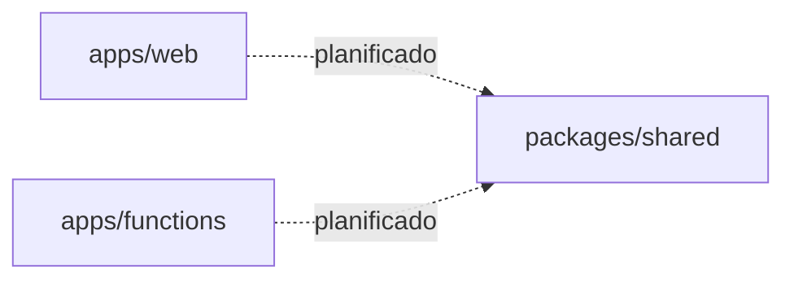

# Dependencies

## Internal Dependencies

### apps/web depends on packages/shared

- **Type**: Compile (planificado — actualmente no hay import directo en codigo)
- **Reason**: Compartir schemas Zod y tipos entre frontend y backend

### apps/functions depends on packages/shared

- **Type**: Compile (planificado)
- **Reason**: Validacion de payloads en Cloud Functions

## External Dependencies — apps/web (produccion)

| Dependencia           | Version  | Proposito             |
| --------------------- | -------- | --------------------- |
| next                  | ^14.2.0  | Framework web         |
| react / react-dom     | ^18.3.0  | UI                    |
| zod                   | ^3.23.0  | Validacion env        |
| @tanstack/react-query | ^5.56.0  | Data fetching         |
| @tanstack/react-table | ^8.20.0  | Tablas admin          |
| zustand               | ^4.5.0   | Estado UI             |
| react-hook-form       | ^7.53.0  | Formularios           |
| @hookform/resolvers   | ^3.9.0   | Integracion Zod forms |
| Radix UI packages     | varios   | Primitivos UI         |
| tailwindcss           | ^3.4.0   | CSS                   |
| lucide-react          | ^0.445.0 | Iconos                |
| next-themes           | ^0.3.0   | Tema                  |
| sonner                | ^1.5.0   | Toasts                |

## External Dependencies — packages/shared

| Dependencia | Version | Proposito                         |
| ----------- | ------- | --------------------------------- |
| zod         | ^3.23.0 | Schemas compartidos (planificado) |

## External Dependencies — root (dev)

| Dependencia          | Proposito          |
| -------------------- | ------------------ |
| vitest + coverage-v8 | Testing            |
| eslint + plugins     | Linting            |
| prettier             | Formatting         |
| husky + lint-staged  | Git hooks          |
| @commitlint/\*       | Commit conventions |
| typescript           | Type checking      |

## Dependencias planificadas (no instaladas aun)

| Dependencia           | Proposito                   | SDD       |
| --------------------- | --------------------------- | --------- |
| firebase (client SDK) | Auth, Firestore client-side | SDD-03    |
| firebase-admin        | Server-side + Functions     | SDD-03/06 |
| firebase-functions    | Cloud Functions runtime     | SDD-06    |

## Workspace Configuration

- **Manager**: pnpm workspaces
- **Lock file**: `pnpm-lock.yaml`
- **Node version**: `.nvmrc` → 20
- **Registry**: `.npmrc` configurado
