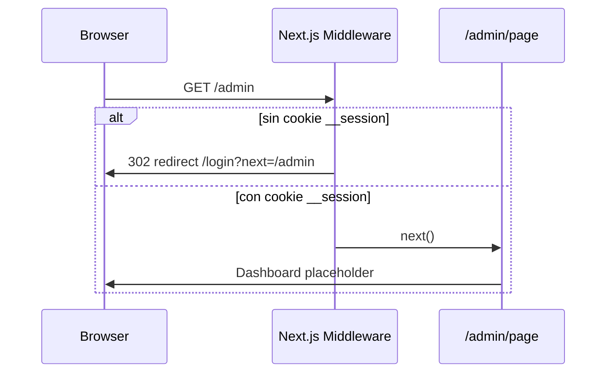
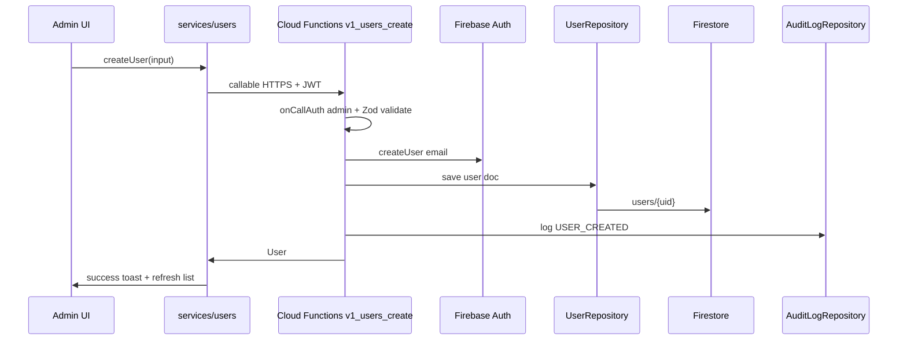
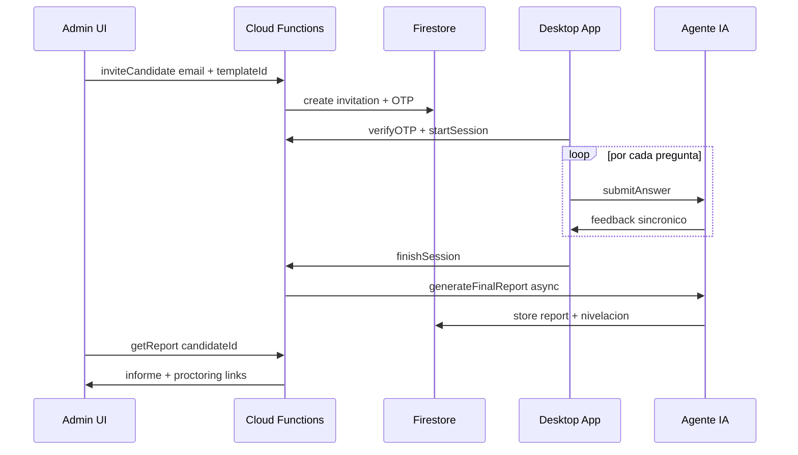
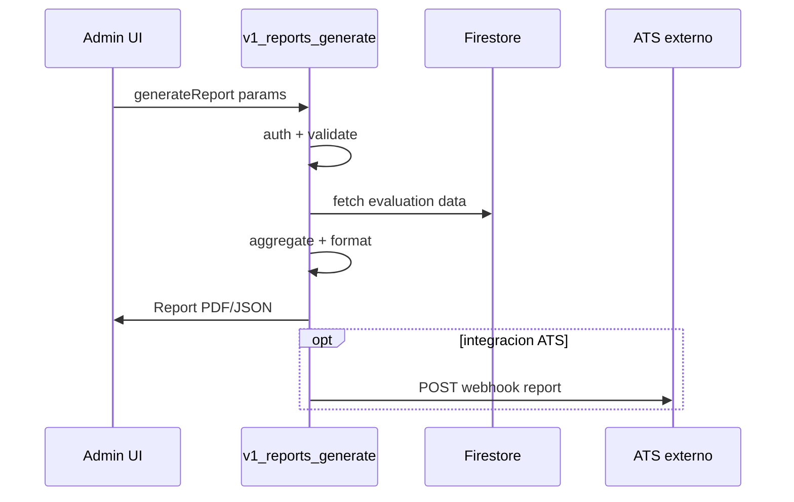

# Interaction Diagrams

Diagramas de secuencia que muestran como las transacciones de negocio se implementan (o se planifican implementar) entre componentes.

## BT-01: Acceso a area admin (implementacion parcial)

**Estado actual**: Middleware verifica cookie `__session`; login no implementado.

## BT-02: Crear usuario (planificado SDD-04/05/06)

## BT-05: Flujo candidato evaluacion (planificado - System Design)

## BT-06: Generar reporte (planificado SDD-06)

