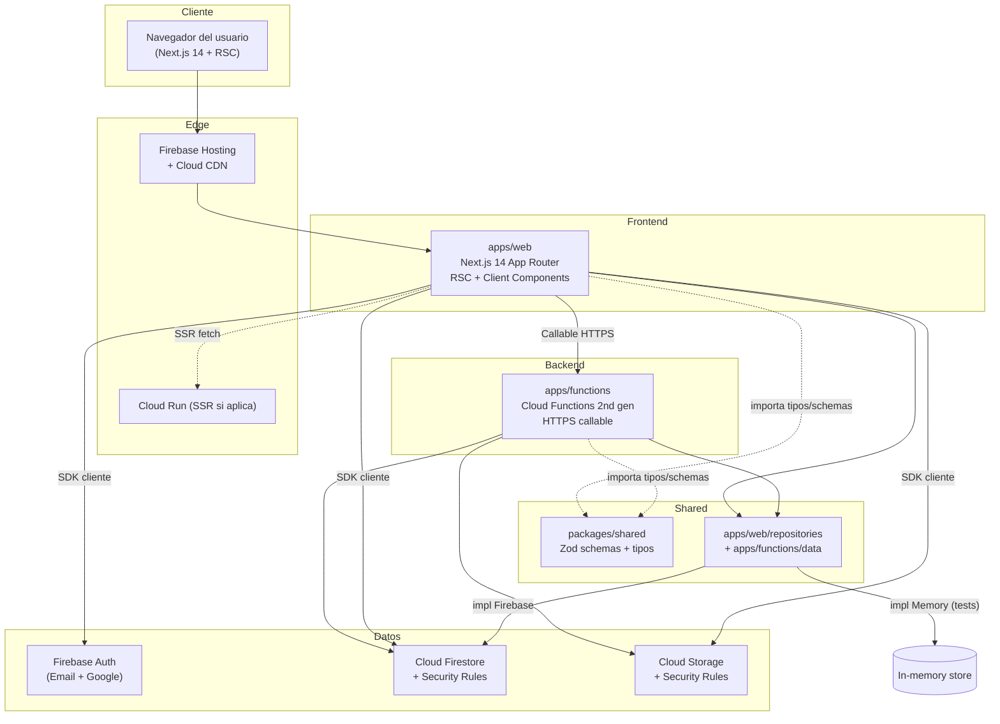
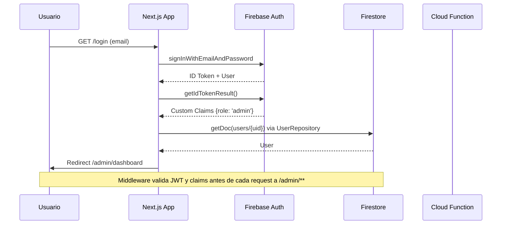
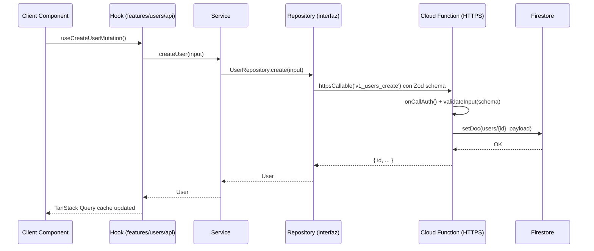

# Architecture Overview

> **Estado:** Approved (pending)
> **Versión:** 1.0

---

## 1. Vista de capas (la regla de oro)

```
┌─────────────────────────────────────────────────────────────┐
│  /app  +  /components  +  /features        →  React/Next    │
│  (UI, hooks, formularios)                  NO TOCA FIREBASE  │
├─────────────────────────────────────────────────────────────┤
│  /services                                →  Lógica negocio │
│  (orquestación, casos de uso)             NO TOCA FIREBASE  │
├─────────────────────────────────────────────────────────────┤
│  /repositories  ←  INTERFAZ  +  IMPL  +  MEMORY            │
│  users/, organizations/, auditLogs/       ÚNICA QUE TOCA   │
│  FirebaseUserRepository  MemoryUserRepo   FIREBASE          │
├─────────────────────────────────────────────────────────────┤
│  /lib                                       →  SDK wrapper  │
│  firebase/client.ts, firebase/admin.ts     SDK inicializado │
└─────────────────────────────────────────────────────────────┘
```

**Reglas:**

- Flecha hacia abajo: permitido.
- Flecha hacia arriba: **prohibido**.
- `/repositories/<entidad>/index.ts` exporta **solo la interfaz y el tipo de error**. Las impls se exportan desde `firebase.ts` y `memory.ts` y se inyectan vía factory.
- `/lib/firebase/*` es el único lugar donde se importan los SDK de Firebase.

---

## 2. Diagrama de sistema (alto nivel)



---

## 3. Estructura de monorepo

```
.
├── apps/
│   ├── web/                  # Next.js 14
│   │   ├── app/              # Rutas (App Router)
│   │   ├── components/       # UI reutilizable
│   │   ├── components/ui/    # shadcn/ui (no editar a mano)
│   │   ├── features/         # Módulos por dominio
│   │   ├── repositories/     # Única capa que toca Firebase
│   │   ├── services/         # Lógica de negocio
│   │   ├── lib/              # Utils + wrappers Firebase
│   │   ├── config/           # env.ts, constants
│   │   ├── types/            # Tipos compartidos con front
│   │   └── ...
│   └── functions/            # Cloud Functions 2nd gen
│       ├── src/
│       │   ├── v1/
│       │   │   ├── users/
│       │   │   │   ├── createUser.ts
│       │   │   │   └── ...
│       │   │   └── reports/
│       │   │       └── generateReport.ts
│       │   ├── lib/          # onCallAuth, validateInput, errors
│       │   └── index.ts      # Entry point
│       └── ...
├── packages/
│   └── shared/               # Tipos + Zod schemas compartidos
│       ├── src/
│       │   ├── schemas/      # Zod schemas
│       │   ├── types/        # Tipos inferidos
│       │   └── errors/       # Tipos de error compartidos
│       └── ...
├── firebase.json             # Config Firebase + emulators
├── firestore.rules
├── storage.rules
├── .github/workflows/
├── pnpm-workspace.yaml
├── package.json
└── ...
```

---

## 4. Flujos críticos

### 4.1 Login + acceso a `/admin`



### 4.2 Llamada a Cloud Function desde el front



> **Nota clave:** el service NUNCA llama al Cloud Function directamente. Pasa por la interfaz del repository. En tests, `MemoryUserRepository.create` no toca Firebase.

---

## 5. Decisiones arquitectónicas (resumen)

| #   | Decisión                                                      | ADR                                               |
| --- | ------------------------------------------------------------- | ------------------------------------------------- |
| 1   | Monorepo pnpm con `apps/*` y `packages/*`                     | [0001](./decisions/0001-monorepo-pnpm.md)         |
| 2   | Repository pattern con interfaz + impl Firebase + impl Memory | [0002](./decisions/0002-repository-pattern.md)    |
| 3   | Firestore (no Realtime Database)                              | [0003](./decisions/0003-firestore-over-rtdb.md)   |
| 4   | Zod compartido cliente/servidor en `packages/shared`          | [0004](./decisions/0004-zod-shared-validation.md) |

---

## 6. Componentes clave (responsabilidades)

### 6.1 `apps/web`

- Renderizar UI (Server + Client Components).
- Manejar autenticación del lado cliente.
- Manejar estado de UI (Zustand, TanStack Query).
- **NO**: lógica de negocio compleja (eso es `/services`).
- **NO**: acceso directo a Firestore/Storage desde componentes.

### 6.2 `apps/functions`

- Endpoints HTTPS callable v1 (`/v1/<recurso>/<acción>`).
- Validación de input con Zod.
- Verificación de auth + custom claims.
- Llamadas a Firestore/Storage Admin SDK.
- **NO**: lógica de UI.
- **NO**: re-exportar SDKs al front.

### 6.3 `packages/shared`

- Schemas Zod (entrada y salida).
- Tipos TypeScript inferidos.
- Errores tipados compartidos.
- **NO**: dependencias de Firebase, Next.js o React.

### 6.4 `apps/web/repositories` y `apps/web/services`

- **Services**: orquestan casos de uso. Reciben un repository por DI. Combinan llamadas, transforman datos.
- **Repositories**: única capa que conoce el vendor. Interfaz agnóstica + impls intercambiables.

---

## 7. Configuración por entorno

Tres entornos: `dev` (emuladores), `staging`, `prod`. Cada uno con su propio proyecto Firebase, alias y secrets.

| Env     | Firebase project alias | Hosts permitidos                     | CORS allowlist |
| ------- | ---------------------- | ------------------------------------ | -------------- |
| dev     | `<project>-dev`        | `localhost:3000`, `127.0.0.1:3000`   | mismo          |
| staging | `<project>-staging`    | `staging.example.com`                | mismo          |
| prod    | `<project>-prod`       | `app.example.com`, `www.example.com` | mismo          |

Las variables se validan con Zod al arranque (`/config/env.ts`). Cualquier variable requerida que falgue o sea inválida **falla el build**, no la primera request.

---

## 8. Seguridad — checklist por defecto

- [x] Reglas de Firestore niegan por defecto.
- [x] Reglas de Storage niegan por defecto.
- [x] Custom Claims como única fuente de verdad para roles.
- [x] JWT verificado en cada endpoint protegido (server-side).
- [x] Helmet + CORS explícito en Cloud Functions.
- [x] Secrets fuera del código (Secret Manager + `.env.local` ignorado).
- [x] `gitleaks` en pre-commit y CI.

---

## 9. Performance — objetivos

- LCP < 2.5s en landing del admin.
- Bundle inicial < 200KB gzip.
- TTFB < 600ms para rutas estáticas.
- Firebase cold start < 2s (mín. instances = 1 en staging/prod para endpoints críticos).

---

## 10. Versionado del paquete de arquitectura

Este documento se versiona junto con el repo. Cambios incompatibles hacia atrás requieren migración documentada en `03-appendix/migration-log.md` (a crear en Fase 9).
